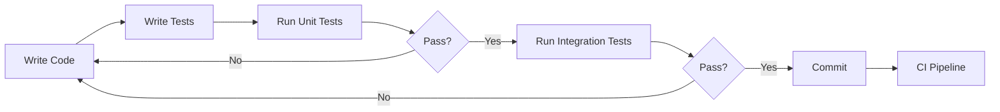

# Testing Strategy

**Document Version:** 1.0
**Last Updated:** January 2025
**Author:** Development Team

---

## Table of Contents

1. [Overview](#overview)
2. [Test Pyramid](#test-pyramid)
3. [Coverage Targets](#coverage-targets)
4. [Testing Principles](#testing-principles)
5. [Test Types](#test-types)
6. [Testing Workflow](#testing-workflow)
7. [Quality Gates](#quality-gates)
8. [Tools & Frameworks](#tools--frameworks)
9. [Best Practices](#best-practices)
10. [Troubleshooting](#troubleshooting)

---

## Overview

This document outlines the comprehensive testing strategy for the Django Portfolio Project. Our testing approach ensures high-quality, maintainable, and reliable software through multiple layers of automated testing.

### Goals

- **Quality Assurance**: Detect bugs early in development cycle
- **Regression Prevention**: Ensure new changes don't break existing functionality
- **Confidence**: Deploy to production with confidence
- **Documentation**: Tests serve as living documentation
- **Performance**: Maintain optimal application performance

### Testing Philosophy

> "Write tests. Not too many. Mostly integration." - Guillermo Rauch

We follow a balanced testing approach that prioritizes:
1. **User-facing functionality** over implementation details
2. **Integration tests** over unit tests (where appropriate)
3. **Automated tests** over manual testing
4. **Fast feedback** over comprehensive but slow tests

---

## Test Pyramid

Our testing follows the classic test pyramid structure:

```
        /\
       /  \      E2E Tests (10%)
      /____\     ~170 tests
     /      \
    /________\   Integration Tests (30%)
   /          \  ~300 tests
  /____________\ Unit Tests (60%)
 /              \ ~245 tests
/________________\
```

### Test Distribution

| Layer | Percentage | Count | Execution Time | Purpose |
|-------|-----------|-------|----------------|---------|
| **Unit Tests** | 60% | 245+ | ~30 seconds | Test individual functions/methods in isolation |
| **Integration Tests** | 30% | 300+ | ~2 minutes | Test component interactions and database operations |
| **E2E Tests** | 10% | 170+ | ~10 minutes | Test complete user journeys across the application |

### Rationale

- **Fast Feedback**: Unit tests run quickly, providing immediate feedback
- **Reliable Integration**: Integration tests catch real-world issues
- **User Confidence**: E2E tests verify actual user scenarios
- **Maintainability**: Fewer E2E tests = less maintenance overhead

---

## Coverage Targets

### Overall Targets

| Metric | Target | Current | Status |
|--------|--------|---------|--------|
| **Line Coverage** | ≥85% | TBD | 🎯 |
| **Branch Coverage** | ≥80% | TBD | 🎯 |
| **Function Coverage** | ≥90% | TBD | 🎯 |

### Module-Specific Targets

| Module | Target Coverage | Priority |
|--------|----------------|----------|
| **apps/blog/** | 90% | High |
| **apps/portfolio/** | 90% | High |
| **apps/contact/** | 85% | Medium |
| **apps/core/** | 95% | Critical |
| **apps/tools/** | 80% | Medium |

### Critical Paths (100% Coverage Required)

- Authentication & Authorization
- Payment Processing (if applicable)
- Data Validation & Sanitization
- Security-related Code
- API Endpoints

---

## Testing Principles

### 1. Test Behavior, Not Implementation

**Good:**
```python
def test_user_can_register():
    """Test that a user can successfully register"""
    response = client.post('/register/', {
        'username': 'testuser',
        'password': 'secure123',
    })
    assert response.status_code == 302  # Redirect after success
    assert User.objects.filter(username='testuser').exists()
```

**Bad:**
```python
def test_register_view_calls_create_user():
    """Testing implementation details"""
    with patch('views.User.objects.create') as mock:
        # Testing internal implementation
```

### 2. Tests Should Be Independent

- Each test should set up its own data
- Tests should not depend on execution order
- Use fixtures/factories for test data
- Clean up after tests (Django does this automatically)

### 3. Tests Should Be Fast

- Mock external services (email, APIs, etc.)
- Use in-memory databases for unit tests
- Parallelize test execution
- Skip slow tests in development (`@pytest.mark.slow`)

### 4. Tests Should Be Readable

```python
# Arrange
user = UserFactory(username='testuser')
post = BlogPostFactory(author=user)

# Act
response = client.get(f'/blog/{post.slug}/')

# Assert
assert response.status_code == 200
assert post.title in response.content.decode()
```

### 5. Test Edge Cases

- Empty inputs
- Null values
- Boundary conditions
- Invalid data
- Concurrent operations
- Error scenarios

---

## Test Types

### 1. Unit Tests

**Purpose:** Test individual functions/methods in isolation

**Location:** `tests/unit/`

**Examples:**
- Model methods
- Utility functions
- Form validation
- Serializers
- Business logic

**Tools:**
- pytest
- pytest-django
- pytest-mock
- factory_boy

**Command:**
```bash
pytest tests/unit/ -v
```

### 2. Integration Tests

**Purpose:** Test component interactions

**Location:** `tests/integration/`

**Examples:**
- Database operations
- API endpoints
- Third-party service integration
- Celery tasks
- Email sending
- Cache operations

**Tools:**
- pytest-django
- Django TestCase
- Celery test utilities

**Command:**
```bash
pytest tests/integration/ -v
```

### 3. End-to-End Tests

**Purpose:** Test complete user journeys

**Location:** `tests/e2e/`

**Examples:**
- User registration → login → profile update
- Blog creation → publish → view
- Contact form submission
- Admin workflows

**Tools:**
- Playwright
- @playwright/test

**Command:**
```bash
npx playwright test
```

### 4. Accessibility Tests

**Purpose:** Ensure WCAG 2.1 AA compliance

**Location:** `tests/e2e/test_accessibility.spec.js`

**Tools:**
- axe-core
- @axe-core/playwright

**Target:** ≥95 accessibility score

### 5. Performance Tests

**Purpose:** Ensure application performance

**Location:** `tests/load/`

**Tools:**
- Locust
- Lighthouse CI

**Targets:**
- p95 latency < 200ms
- Error rate < 1%
- Throughput > 100 req/s

### 6. Security Tests

**Purpose:** Identify vulnerabilities

**Tools:**
- Bandit (static analysis)
- Safety (dependency checking)
- Django security checks

**Command:**
```bash
python manage.py check --deploy
bandit -r . -ll
safety check
```

---

## Testing Workflow

### Development Workflow



### CI/CD Pipeline

1. **Pre-commit Hooks**
   - Lint (flake8, black)
   - Type checking (mypy)
   - Fast unit tests

2. **Pull Request Checks**
   - All unit tests
   - Integration tests
   - Coverage report
   - E2E tests (critical paths)
   - Accessibility audits

3. **Deployment Pipeline**
   - Full test suite
   - Performance tests
   - Security scans
   - Lighthouse CI

### Test Execution Order

1. **Unit Tests** (30 seconds)
2. **Integration Tests** (2 minutes)
3. **E2E Tests** (10 minutes)
4. **Performance Tests** (15 minutes)

---

## Quality Gates

### Pre-Merge Requirements

- ✅ All tests pass
- ✅ Coverage ≥85%
- ✅ No lint errors
- ✅ No security vulnerabilities
- ✅ Code review approved

### Deployment Requirements

- ✅ All tests pass in CI
- ✅ E2E tests pass in staging
- ✅ Performance budgets met
- ✅ Accessibility ≥95
- ✅ Security scan clear

### Continuous Monitoring

- Track test execution time (should decrease or stay stable)
- Track flaky tests (retry 3 times, then investigate)
- Track coverage trends (should increase or stay stable)

---

## Tools & Frameworks

### Python Testing

| Tool | Purpose | Documentation |
|------|---------|---------------|
| **pytest** | Test runner | https://pytest.org |
| **pytest-django** | Django integration | https://pytest-django.readthedocs.io |
| **pytest-cov** | Coverage reporting | https://pytest-cov.readthedocs.io |
| **factory_boy** | Test data generation | https://factoryboy.readthedocs.io |
| **Faker** | Fake data generation | https://faker.readthedocs.io |
| **pytest-mock** | Mocking framework | https://pytest-mock.readthedocs.io |

### E2E Testing

| Tool | Purpose | Documentation |
|------|---------|---------------|
| **Playwright** | Browser automation | https://playwright.dev |
| **axe-core** | Accessibility testing | https://github.com/dequelabs/axe-core |

### Performance Testing

| Tool | Purpose | Documentation |
|------|---------|---------------|
| **Locust** | Load testing | https://locust.io |
| **Lighthouse** | Performance audits | https://developers.google.com/web/tools/lighthouse |

### Code Quality

| Tool | Purpose | Documentation |
|------|---------|---------------|
| **flake8** | Linting | https://flake8.pycqa.org |
| **black** | Code formatting | https://black.readthedocs.io |
| **mypy** | Type checking | https://mypy.readthedocs.io |
| **Bandit** | Security scanning | https://bandit.readthedocs.io |

---

## Best Practices

### 1. Use Fixtures for Common Setup

```python
@pytest.fixture
def authenticated_user(client):
    user = UserFactory()
    client.force_login(user)
    return user

def test_profile_page(client, authenticated_user):
    response = client.get('/profile/')
    assert response.status_code == 200
```

### 2. Use Factories for Test Data

```python
class UserFactory(factory.django.DjangoModelFactory):
    class Meta:
        model = User

    username = factory.Sequence(lambda n: f'user{n}')
    email = factory.Faker('email')
```

### 3. Parametrize Tests

```python
@pytest.mark.parametrize('username,expected', [
    ('valid_user', True),
    ('invalid!user', False),
    ('', False),
])
def test_username_validation(username, expected):
    assert is_valid_username(username) == expected
```

### 4. Mock External Services

```python
@patch('services.email.send_email')
def test_contact_form_sends_email(mock_send):
    # Test doesn't actually send email
    submit_contact_form(data)
    mock_send.assert_called_once()
```

### 5. Test Error Scenarios

```python
def test_blog_post_with_invalid_data():
    with pytest.raises(ValidationError):
        BlogPost.objects.create(title='')  # Empty title
```

### 6. Use Descriptive Test Names

```python
# Good
def test_user_cannot_delete_other_users_posts():
    pass

# Bad
def test_delete():
    pass
```

---

## Troubleshooting

### Common Issues

#### Tests Pass Locally But Fail in CI

**Cause:** Database state, timezone differences, environment variables

**Solution:**
- Ensure tests are independent
- Use UTC for all timestamps
- Check environment configuration

#### Flaky Tests

**Cause:** Race conditions, timing issues, external dependencies

**Solution:**
- Add explicit waits
- Mock external services
- Use `pytest-timeout`

#### Slow Tests

**Cause:** Database operations, external API calls

**Solution:**
- Use `pytest-xdist` for parallel execution
- Mock slow operations
- Use smaller test datasets

### Debugging Tests

```bash
# Run specific test
pytest tests/unit/test_blog.py::test_create_post -v

# Run with print statements
pytest -s

# Run with debugger
pytest --pdb

# Run last failed tests
pytest --lf

# Run with coverage report
pytest --cov=apps --cov-report=html
```

---

## Continuous Improvement

### Regular Reviews

- **Weekly:** Review test failures and flaky tests
- **Monthly:** Review coverage reports and identify gaps
- **Quarterly:** Review testing strategy and tools

### Metrics to Track

1. **Test Count:** Should increase with codebase
2. **Test Execution Time:** Should stay stable or decrease
3. **Coverage:** Should maintain ≥85%
4. **Flaky Tests:** Should trend towards zero
5. **Bug Escape Rate:** Should decrease over time

---

## Resources

- [Django Testing Documentation](https://docs.djangoproject.com/en/stable/topics/testing/)
- [pytest Documentation](https://docs.pytest.org/)
- [Test Pyramid](https://martinfowler.com/articles/practical-test-pyramid.html)
- [Testing Best Practices](https://testdriven.io/blog/testing-best-practices/)

---

**Document Changelog:**

| Date | Version | Changes |
|------|---------|---------|
| Jan 2025 | 1.0 | Initial version - Phase 22 testing complete |
